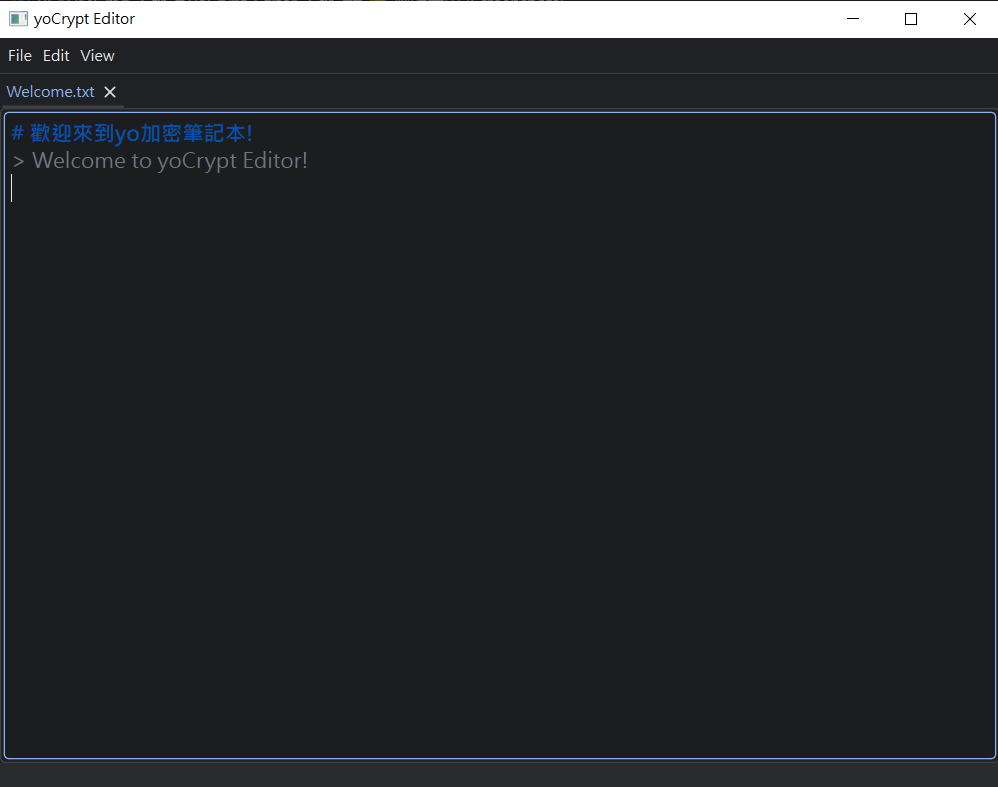

# yoCrypt-Editor

  
  
  
  

## 🎨 Screenshots(軟體截圖)

  

---

# English

**yoCrypt-Editor** is a high-performance, lightweight text editor designed for simplicity and security. By combining the flexibility of Python with the computational power of C++, it provides industrial-grade encryption for your private notes in a clean, distraction-free environment.

## ✨ Key Features

- **Ultra-Lightweight & Fast**: Optimized startup speeds and low resource consumption for a seamless editing experience.
- **Clean UI Design**: Built with **PySide6** and **QDarkTheme** to provide a modern, elegant dark-mode interface.
- **Industrial-Grade Encryption**: Powered by a native **OpenSSL 3** core for maximum data protection.
- **Out-of-the-Box Experience**: Comes bundled with all necessary DLLs; no external OpenSSL or C++ redistributables are required.
- **Advanced Core Logic**: Integrates the proprietary `yotools200.utils` for optimized internal operations and performance.

## 🚀 Getting Started

To get started, visit the [GitHub Releases](https://github.com/Yoyo-ace1110/yoCrypt-Editor/releases) page to download the latest version. Simply extract the files and run `main.exe` (or `main/main.exe`).

## 🛠️ Development & Dependencies

If you wish to build from source or contribute, please ensure your environment includes:

- **Python 3.x**
- **PySide6**: Modern Qt6 Python bindings.
- **QDarkTheme**: High-quality dark theme support.
- **yotools200**: Custom utility toolkit (included in the repository).
- **OpenSSL 3.x**: (Native DLLs are included; header files are required for compilation).

## 🐞 Report a Bug

If you encounter any issues or have suggestions for improvements, please reach out via:

1. **GitHub Issues**: [Submit an Issue](https://github.com/Yoyo-ace1110/yoCrypt-Editor/issues)
2. **Email**: [liaojiayouy@gmail.com](mailto:liaojiayouy@gmail.com)

## 🌐 Websites & Resources

- **Official Repository**: [yoCrypt-Editor GitHub](https://github.com/Yoyo-ace1110/yoCrypt-Editor)
- **Core Technologies**: [PySide6](https://pypi.org/project/PySide6/) | [OpenSSL](https://www.openssl.org/) | [QDarkTheme](https://github.com/5yutan5/PyQt-Dark-Theme)

## ⚖️ Copyright & License

Copyright (c) 2026 Yoyo-ace1110. All Rights Reserved.

This project is released under terms designed to ensure transparency and security:
- **As-Is Distribution**: Redistribution is allowed only in its original, unmodified form with proper attribution.
- **Non-Commercial**: Any commercial use, sale, or leasing of this software is strictly prohibited.
- For full licensing details, please refer to [License.txt](https://github.com/Yoyo-ace1110/yoCrypt-Editor/blob/main/License.txt) or contact the author.

---

# 繁體中文

**yoCrypt-Editor** 是一款旨在建立**輕量、快速、介面簡潔**，並整合**加密功能**的文字編輯器。它結合了 Python 的開發彈性與 C++ 的運算效能，為您的私人文件提供最可靠的保護。

## ✨ 主要特性 (Features)

- **極致輕量與快速**：優化的啟動速度與低資源佔用，讓文字處理流暢無負擔。
- **簡潔 UI 設計**：基於 **PySide6** 與 **QDarkTheme**，提供現代化且專注的作業環境。
- **內建強大加密**：整合 **OpenSSL 3** 核心技術，確保您的資料安全性達到工業級標準。
- **無縫執行體驗**：內建所有必要的 DLL，使用者無需額外安裝 OpenSSL 或 C++ 運行庫即可直接執行。
- **開發者工具整合**：使用自有的 `yotools200.utils` 優化內部運作邏輯與資料處理。

## 🚀 快速開始 (Getting Started)

前往 [GitHub Releases](https://github.com/Yoyo-ace1110/yoCrypt-Editor/releases) 下載最新的版本，解壓後直接執行 `main.exe` 或是 `main/main.exe` 即可開始使用。

## 🛠️ 開發與依賴 (Dependencies)

如果你希望從源碼運行或進行開發，請確保環境中包含以下依賴：

- **Python 3.x**
- **PySide6**: 現代化的 Qt6 Python 綁定。
- **QDarkTheme**: 提供高品質的深色視覺主題。
- **yotools200**: 作者開發的工具集（已附於專案中）。
- **OpenSSL 3.x**: (專案已內建 libcrypto/libssl DLL，開發環境編譯時需配置對應標頭檔)。

## 🐞 問題回報 (Report a Bug)

如果您在使用過程中遇到任何問題，或有功能改進建議，歡迎透過以下管道聯繫：

1. **GitHub Issues**: [直接在這裡提交 Issue](https://github.com/Yoyo-ace1110/yoCrypt-Editor/issues)
2. **Email**: [liaojiayouy@gmail.com](mailto:liaojiayouy@gmail.com)

## 🌐 相關連結 (Websites)

- **官方專案首頁**: [yoCrypt-Editor GitHub](https://github.com/Yoyo-ace1110/yoCrypt-Editor)
- **核心技術**: [PySide6](https://pypi.org/project/PySide6/) | [OpenSSL](https://www.openssl.org/) | [QDarkTheme](https://github.com/5yutan5/PyQt-Dark-Theme)

## ⚖️ 授權與版權 (Copyright & License)

Copyright (c) 2026 Yoyo-ace1110. All Rights Reserved.

[cite_start]本專案採用的條款旨在確保專案的透明度與安全性 [cite: 1]：
- [cite_start]**允許原樣散佈**：允許在保持檔案原始狀態且註明出處（附帶原作者連結）的前提下進行散佈 [cite: 4, 5]。
- [cite_start]**禁止商業行為**：嚴禁任何形式的商業銷售、出租或作為收費服務的一部分 [cite: 6]。
- [cite_start]**免責聲明**：本軟體按「原樣」提供，作者不承擔任何使用後果或損害賠償 [cite: 8, 9, 10]。
- [cite_start]欲了解完整授權細節，請參閱 [License.txt](https://github.com/Yoyo-ace1110/yoCrypt-Editor/blob/main/License.txt) [cite: 11]。

