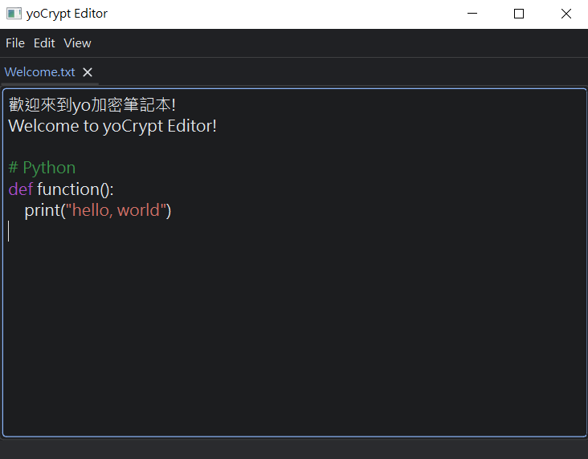

<link rel="shortcut icon" type="image/x-icon" href="https://yoyo-ace1110.github.io/yoCrypt-Editor/assets/favicon.ico">

# Welcome to yoCrypt-Editor

  
    
  
  
  

  <h3 align="center">Please select your language to continue:</h3>
  <table align="center" style="border: none; border-collapse: collapse;">
    <tr style="border: none;">
      <td style="border: none; padding: 20px;">
        <a href="./en/home" style="font-size: 1.5em; text-decoration: none;">English</a>
      </td>
      <td style="border: none; padding: 20px;">
        <a href="./zh-TW/home" style="font-size: 1.5em; text-decoration: none;">繁體中文</a>
      </td>
    </tr>
  </table>

### 🎨 Screenshot

  

---

  <small>
    © 2026 Yoyo-ace1110. All Rights Reserved. 
    Built with PySide6 & OpenSSL 3. 
    [<a href="mailto:liaojiayouy@gmail.com">Contact</a>] 
    [<a href="https://github.com/Yoyo-ace1110/yoCrypt-Editor">GitHub</a>]
  </small>

